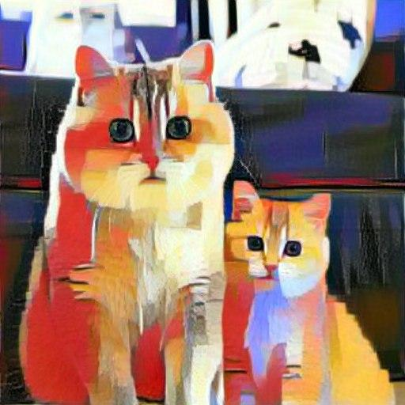

# python-telegram-bot
How to run:

pip install -r requirements.txt

python main.py

Example
Content:
{:height="25%" width="25%"}

Style:
{:height="25%" width="25%"}

Output:
{:height="25%" width="25%"}